# 📚 LibQueue — Sistema de Gerenciamento de Biblioteca Escolar


---

## 📑 Índice

- [Descrição do Projeto](#-descrição-do-projeto)
  - [Destaques](#destaques)
- [Regras de Negócio](#-regras-de-negócio)
- [Status do Projeto](#-status-do-projeto)
- [Funcionalidades](#-funcionalidades)
  - [Gerenciamento de Usuários](#-gerenciamento-de-usuários)
  - [Gerenciamento do Acervo](#-gerenciamento-do-acervo)
  - [Empréstimos e Devoluções](#-empréstimos-e-devoluções)
  - [Reservas com Prioridade](#-reservas-com-prioridade)
- [Persistência](#-persistência)
- [Simulação de Controle de Cadastro](#-simulação-de-controle-de-cadastro)
- [Testes e Demonstração](#%EF%B8%8F-testes-e-demonstração)
- [Screenshots](#%EF%B8%8F-screenshots)
- [Tecnologias e Arquitetura](#%EF%B8%8F-tecnologias-e-arquitetura)
  - [Tecnologias](#tecnologias)
  - [Arquitetura](#arquitetura)
- [Contexto Acadêmico e Documentação](#-contexto-acadêmico-e-documentação)
- [Estrutura de Branches](#-estrutura-de-branches)
- [Documentação](#documentação)
- [Como Executar o Projeto](#-como-executar-o-projeto)
  - [Pré-requisitos](#pré-requisitos)
  - [Executando pelo Código-Fonte](#executando-pelo-código-fonte)
---

## 📖 Descrição do Projeto

O **LibQueue** é um sistema de gerenciamento de biblioteca escolar desenvolvido em **Java** e **JavaFX**, utilizando uma arquitetura baseada no padrão **MVC (Model, View, Controller)**, complementada pelas camadas de **Service**, **Repository/DAO** e **Util**.

O sistema foi desenvolvido para controlar:

- usuários e seus perfis;
- acervo e exemplares;
- empréstimos e devoluções;
- reservas e suas respectivas filas;
- disponibilidade dos exemplares.

O projeto começou a ser desenvolvido no curso de **Sistemas de Informação do Instituto Federal da Bahia (IFBA) — Campus Vitória da Conquista**, ao longo das disciplinas de **Estrutura de Dados** e **Linguagem de Programação II**. Atualmente, é mantido como um projeto pessoal, recebendo melhorias, refatorações e novas funcionalidades.

Ao longo desse processo, o sistema evoluiu de uma implementação baseada em estruturas de dados desenvolvidas manualmente e persistência em memória para uma arquitetura que utiliza as coleções da **Java Collections Framework** e persistência permanente em arquivos locais.

### Destaques

Um dos principais recursos do sistema é o gerenciamento de **empréstimos e reservas**. Quando não há exemplares disponíveis de uma obra, o usuário pode solicitar uma reserva. As reservas são organizadas em filas por título, com **prioridade para professores em relação a alunos**, considerando também a ordem de solicitação.

Quando um exemplar é devolvido, a primeira reserva da fila é atendida automaticamente, fazendo com que o exemplar fique reservado para o usuário correspondente.

O sistema também aplica restrições relacionadas a **atrasos** e **limites de empréstimo**. Usuários com empréstimos atrasados ou que atingiram seu limite não podem realizar novos empréstimos ou reservas enquanto a condição persistir.

---

## 📋 Regras de Negócio

As principais regras adotadas pelo sistema são:

| Regra | Professor | Aluno |
|---|---:|---:|
| Prioridade na fila de reservas | Sim | Não |
| Limite de empréstimos simultâneos | 4 livros | 3 livros |
| Prazo para devolução | 7 dias | 7 dias |

Além dessas regras:

- Usuários com empréstimos em atraso ficam impedidos de realizar novos empréstimos e reservas até regularizarem a situação.
- Usuários que atingirem o limite de empréstimos também ficam impedidos de realizar novos empréstimos e reservas.
- Professores e alunos podem registrar empréstimos por suas próprias interfaces.
- O registro de devoluções é realizado exclusivamente pelo usuário com perfil de **bibliotecário/administrador**, responsável pela manipulação dos exemplares no ambiente da biblioteca.
- Quando todos os exemplares de uma obra estão emprestados, os usuários podem entrar na fila de reservas.
- Em caso de devolução de um exemplar reservado, a primeira reserva da fila é atendida automaticamente.

---

## 🚧 Status do Projeto

**Em desenvolvimento — versão estável para demonstração.**

O projeto foi concluído como atividade acadêmica e atualmente é mantido como projeto pessoal, recebendo melhorias, refatorações e novas funcionalidades.

---

## ⚙️ Funcionalidades

### 👤 Gerenciamento de Usuários

- Cadastro de novos usuários;
- Login por e-mail e senha;
- Controle de acesso por perfil;
- Perfis disponíveis:
  - Aluno;
  - Professor;
  - Bibliotecário;
- Validação de identificadores institucionais.

### 📚 Gerenciamento do Acervo

- Cadastro de novos exemplares;
- Consulta de obras por ISBN;
- Agrupamento de exemplares pertencentes à mesma obra;
- Controle de disponibilidade;
- Inclusão e remoção de exemplares.

### 🔄 Empréstimos e Devoluções

- Registro de empréstimos;
- Registro de devoluções;
- Controle de prazos;
- Identificação de empréstimos atrasados;
- Atualização da disponibilidade dos exemplares;
- Aplicação automática das restrições definidas pelas regras de negócio.

### ⏳ Reservas com Prioridade

- Solicitação de reservas;
- Filas independentes para cada obra;
- Prioridade para professores em relação a alunos;
- Organização por prioridade e ordem de solicitação;
- Atendimento automático da primeira reserva após a devolução de um exemplar.

---

## 💾 Persistência
Os dados são persistidos localmente em arquivos de texto armazenados na pasta [`data/`](data). A leitura e escrita dos arquivos 
são centralizadas pela classe [`PersistenceManager`](src/main/java/br/edu/ifba/repository/PersistenceManager.java), 
localizada no pacote `repository`.

## 🪪 Simulação de Controle de Cadastro

Como o sistema foi desenvolvido para simular o ambiente de uma instituição de ensino, foi criado um mecanismo próprio de
identificação para representar a validação de membros da instituição, como professores e estudantes.

Para realizar o cadastro, o usuário deve informar um **identificador institucional válido**, previamente disponibilizado
pelo sistema. Os identificadores utilizados encontram-se em: [data/ids.txt](data/ids.txt)


Eles foram gerados artificialmente para simular uma instituição de ensino e seguem o padrão:

```text
s = Student (Aluno)
p = Professor
l = Bibliotecário
```

Exemplos:

```text
s000007
p000006
l000004
```

Durante o cadastro, o sistema verifica se o identificador informado está presente na lista de IDs válidos. Caso 
contrário, o cadastro não é permitido.

Os identificadores também são preservados durante a Reinicialização Total, garantindo que novos usuários possam ser 
cadastrados mesmo após a limpeza dos demais dados do sistema.

---

## 🖥️ Testes e Demonstração

Para facilitar a validação das funcionalidades e as demonstrações do sistema, o projeto disponibiliza um
[**Guia de Testes**](docs/GUIA_DE_TESTES.md) com instruções para execução dos principais fluxos da aplicação.

Além disso, foram desenvolvidos três modos de reinicialização, pensados para diferentes cenários de teste e utilização
do sistema:

* **Reinicialização Parcial:** cancela todas as reservas e empréstimos e torna todos os livros disponíveis novamente,
  mantendo os demais dados, como livros e usuários cadastrados.

* **Reinicialização para Testes:** remove os dados atuais e restaura os dados de demonstração presentes em
  [`data/seed`](data/seed), retornando o sistema a um estado previamente definido.

* **Reinicialização Total:** remove todos os dados persistidos, exceto o usuário bibliotecário atualmente logado e os
identificadores institucionais. Dessa forma, o administrador mantém o acesso ao sistema e os IDs necessários para novos 
cadastros.

> **Nota:** Os dados utilizados para demonstração foram gerados artificialmente para fins acadêmicos e não correspondem 
a registros reais de uma instituição de ensino.

## 🖼️ Screenshots

### Tela de Autenticação

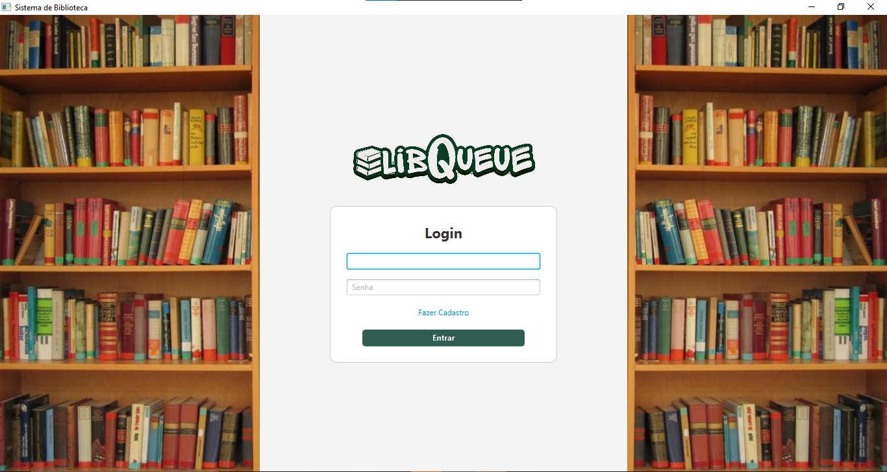

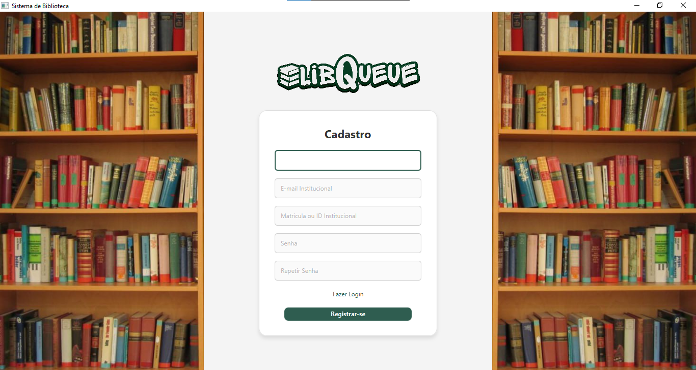

### Interfaces do Usuário

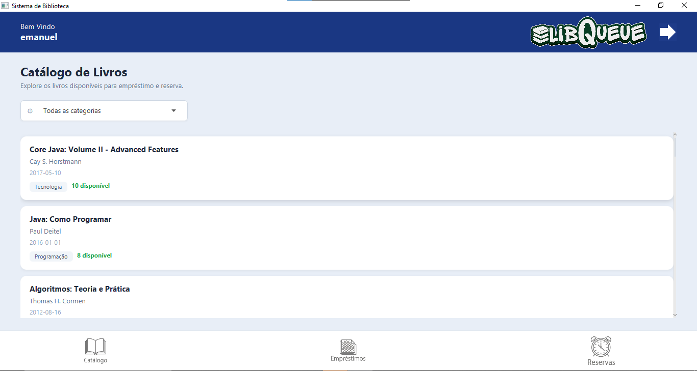

*Catálogo de obras disponíveis no acervo.*


*Empréstimos ativos do usuário.*

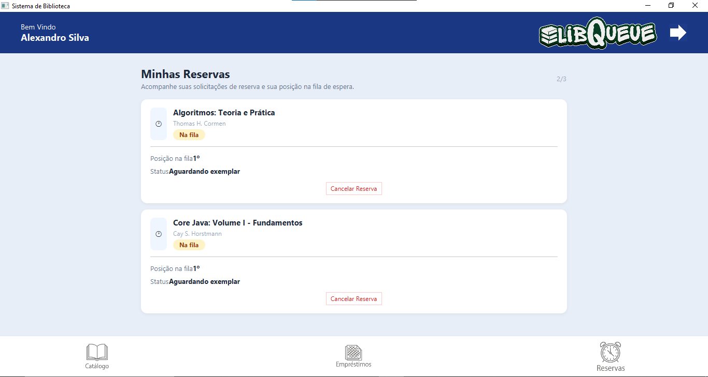

*Reservas realizadas pelo usuário.*

#### Detalhes de uma Obra

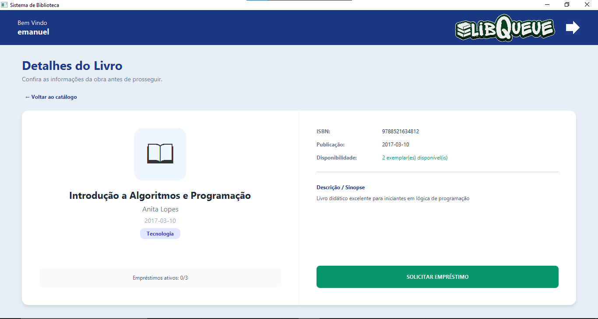

*Detalhes de uma obra e suas informações de disponibilidade.*

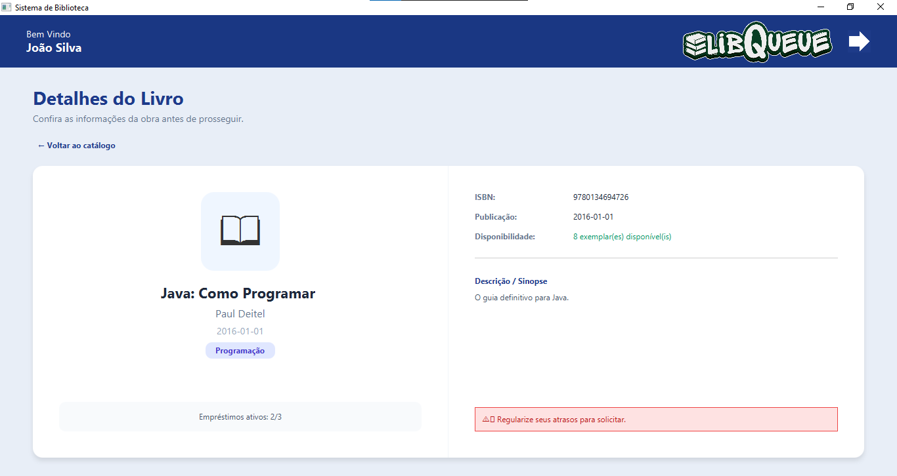

*Restrição de empréstimo quando o usuário possui uma devolução atrasada ou já atingiu alguma das condições que impedem um novo empréstimo.*

### Interfaces do Bibliotecário

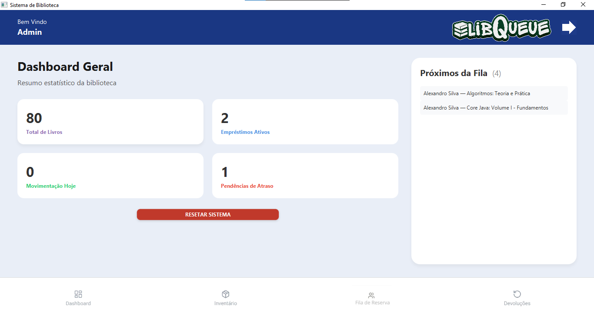

*Dashboard com indicadores gerais do sistema.*

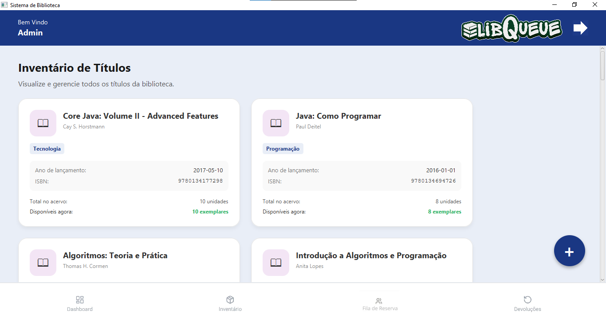

*Gerenciamento do inventário do acervo.*

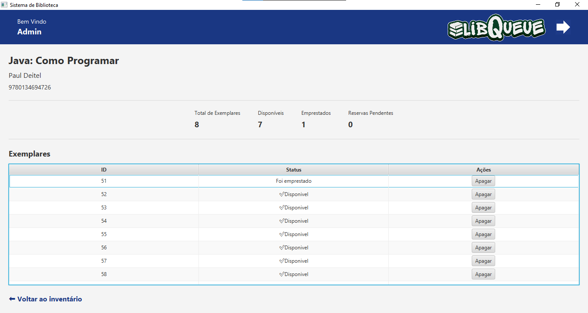

*Gerenciamento dos exemplares associados a uma obra.*

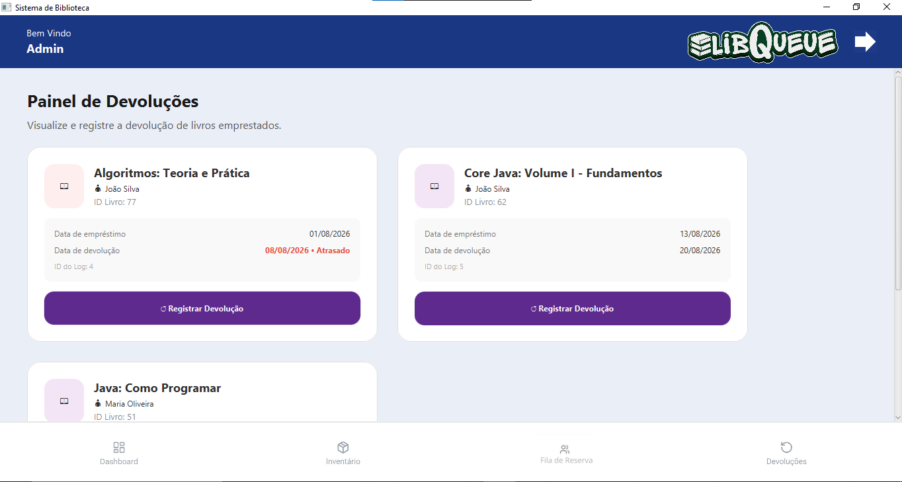

*Controle de empréstimos e devoluções.*

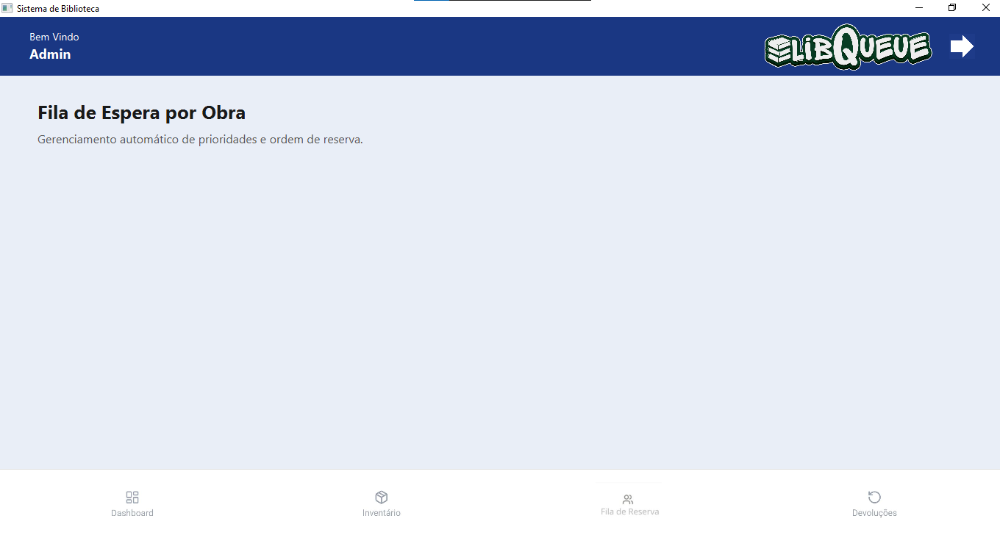

*Gerenciamento das filas de reservas.*

---

## 🛠️ Tecnologias e Arquitetura

### Tecnologias

- **Java 17+**
- **JavaFX**
- **FXML**
- **CSS**
- **Maven**
- **Git**
- **GitHub**

### Arquitetura

O projeto utiliza uma arquitetura baseada nos princípios do padrão **Model-View-Controller (MVC)**, complementada pelas camadas de **Service**, **Repository/DAO** e **Util**.

```text
Model → entidades e estruturas de domínio
View → interfaces FXML e estilização CSS
Controller → controle das interações da interface
Service → regras de negócio e validações
Repository/DAO → gerenciamento e persistência dos dados
Util → funcionalidades auxiliares
```

---

## 🎓 Contexto Acadêmico e Documentação

O **LibQueue** foi concebido no curso de **Sistemas de Informação** do **Instituto Federal da Bahia (IFBA) – Campus Vitória da Conquista**, evoluindo ao longo de duas etapas acadêmicas:

1. **Estrutura de Dados (2026.1):** Foco na implementação manual de estruturas de dados (listas e filas de prioridade customizadas) e persistência em memória.

  * 📄 [Artigo Final de ED](docs/docs_academicos/Artigo_ED.pdf)
  * **Orientador:** Prof. Claudio Rodolfo Santos de Oliveira ([@claudiorodolfo](https://github.com/claudiorodolfo))

2. **Linguagem de Programação II (2026.1):** Evolução para o **Java Collections Framework**, implementação de interface gráfica com **JavaFX** e persistência em arquivos locais (`.txt`).

  * 📄 [Relatório Final de LP2](docs/docs_academicos/Relatorio_LP2.pdf)
  * **Orientador:** Prof. Alexandro dos Santos Silva ([@alexandrossilva](https://github.com/alexandrossilva))

---

## 🌿 Estrutura de Branches

O repositório mantém versões históricas do projeto associadas às disciplinas em que ele foi desenvolvido.

| Branch | Descrição |
|---|---|
| `main` | Versão consolidada e atual do sistema |
| [`archive/ed`](https://github.com/Nuillexe/school-library-manager/tree/archive/ed) | Entrega final da disciplina de Estrutura de Dados |
| [`archive/lp2`](https://github.com/Nuillexe/school-library-manager/tree/archive/Lp2) | Entrega final da disciplina de Linguagem de Programação II |
| [`dev`](https://github.com/Nuillexe/school-library-manager/tree/ed) | Branch atual de desenvolvimento |

A branch **`main`** reúne a versão mais recente e estável do projeto, consolidando as funcionalidades desenvolvidas ao longo das disciplinas e servindo como referência principal para demonstração e portfólio.


## Documentação
Toda a documentação detalhada está disponível na pasta [docs/](docs). 
- [Arquitetura](docs/Arquitetura_do_LibQueue.md)
- [Guia de Tarefas](docs/GUIA_DE_TAREFAS_Lp2.md): Utilizado durante o desenvolvimento da versão final da disciplina de LP2
- [Manual GitHub](docs/MANUAL_GITHUB.md): Utilizado para orientar a equipe na fase academica
- [Guia de Testes](docs/GUIA_DE_TESTES.md)
- [Artigos e Relatorios](docs/docs_academicos)
- [Screenshots das telas](docs/Telas)


## 🚀 Como Executar o Projeto

### Pré-requisitos

Para executar o projeto a partir do código-fonte, é necessário ter instalado:

- **Java 17 ou superior**;
- **Maven**.

### Executando pelo Código-Fonte

Clone o repositório:

```bash
git clone https://github.com/Nuillexe/school-library-manager.git
```
Acesse a pasta do projeto:
```
cd school-library-manager
```
Compile e execute a aplicação utilizando o Maven:

```
mvn clean javafx:run
```
A aplicação será iniciada e a interface gráfica do LibQueue será exibida.