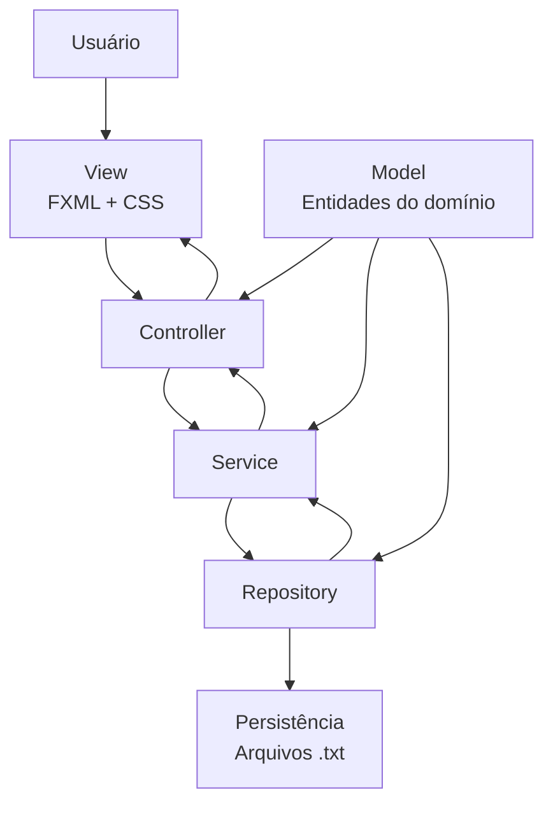
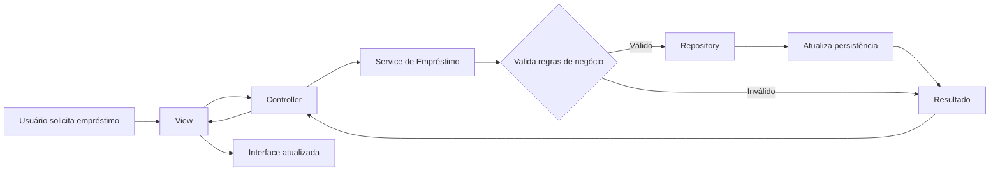

# 🏗️ Arquitetura do LibQueue

## 📑 Índice

- [Visão Geral](#-visão-geral)
- [Estrutura do Projeto](#-estrutura-do-projeto)
- [Camadas da Aplicação](#-camadas-da-aplicação)
    - [Models](#models)
    - [Views](#views)
    - [Controllers](#controllers)
    - [Services](#services)
    - [Repositories](#repositories)
    - [Enums](#enums)
    - [Util](#util)
- [Recursos do JavaFX](#-recursos-do-javafx)
    - [FXML](#fxml)
    - [CSS](#css)
    - [Imagens](#imagens)
- [Fluxo da Aplicação](#-fluxo-da-aplicação)
- [Persistência](#-persistência)
- [Considerações sobre a Arquitetura](#-considerações-sobre-a-arquitetura)

---

## 📖 Visão Geral

O **LibQueue** utiliza uma arquitetura baseada nos princípios do padrão **Model-View-Controller (MVC)**, adaptada à estrutura de uma aplicação **JavaFX** e complementada pelas camadas **Service**, **Repository** e **Util**.

A arquitetura busca separar as diferentes responsabilidades da aplicação, evitando que a interface gráfica, as regras de negócio e a persistência dos dados fiquem concentradas nos mesmos componentes.

Embora seja baseada no padrão MVC, a organização do projeto não segue uma implementação estritamente tradicional. As interfaces da aplicação são definidas utilizando **FXML** e **CSS**, armazenados na pasta `src/main/resources`, enquanto a lógica da aplicação permanece em `src/main/java`.

De forma simplificada, a organização pode ser representada como:

```text
View → Controller → Service → Repository → Persistência
          ↑
        Model
```

Cada camada possui uma responsabilidade específica e se comunica com as demais de acordo com a necessidade da operação realizada.

---

## 📁 Estrutura do Projeto

A estrutura principal do projeto está organizada da seguinte maneira:

```text
src/
├── main/
│   ├── java/
│   │   └── br/
│   │       └── edu/
│   │           └── ifba/
│   │               ├── controller/
│   │               ├── enums/
│   │               ├── models/
│   │               ├── repository/
│   │               ├── service/
│   │               ├── util/
│   │               ├── Launcher.java
│   │               └── MainApp.java
│   │
│   └── resources/
│       ├── images/
│       └── views/
│           ├── auth_views/
│           ├── bibliotecario/
│           └── usuario/
```

A divisão entre `java` e `resources` segue a estrutura utilizada por aplicações Java que possuem recursos externos ao código-fonte.

Os componentes Java ficam em `src/main/java`, enquanto os recursos utilizados pela interface ficam em `src/main/resources`.

---

# 🧩 Camadas da Aplicação

## Models

A camada `models` contém as principais entidades que representam o domínio do sistema.

Entre as entidades estão:

- `Usuario`
- `Livro`
- `Titulo`
- `Emprestimo`
- `Reserva`

Essas classes representam os dados manipulados pelas diferentes partes da aplicação e são utilizadas pelas camadas de negócio e persistência.

Por exemplo, `Emprestimo` representa uma operação de empréstimo realizada por um usuário, enquanto `Reserva` representa uma solicitação de reserva para determinada obra.

Os models não são responsáveis por controlar diretamente a interface gráfica nem por realizar a persistência dos dados.

---

## Views

A camada **View** representa a apresentação gráfica do sistema.

No LibQueue, as views não estão localizadas dentro de `src/main/java`. Elas são implementadas por meio de arquivos **FXML** e **CSS**, armazenados em:

```text
src/main/resources/views/
```

As views são organizadas de acordo com os principais contextos da aplicação:

```text
views/
├── auth_views/
├── bibliotecario/
└── usuario/
```

Essa separação permite manter a definição visual das telas independente da implementação dos seus respectivos controllers.

---

## Controllers

A camada `controller` é responsável por controlar as interações realizadas pelo usuário nas interfaces JavaFX.

Os controllers:

- recebem eventos das interfaces;
- recuperam informações das views;
- acionam os serviços responsáveis pelas operações;
- atualizam a interface de acordo com os resultados das operações;
- realizam a navegação entre telas.

Dessa forma, os controllers funcionam como uma ponte entre a **View** e as demais camadas da aplicação.

As regras de negócio mais importantes não devem ficar concentradas nos controllers. Essas responsabilidades são direcionadas para a camada `service`.

---

## Services

A camada `service` concentra as principais **regras de negócio e validações** do sistema.

Entre suas responsabilidades estão operações relacionadas a:

- empréstimos;
- devoluções;
- reservas;
- disponibilidade de exemplares;
- limites de empréstimos;
- validação das condições para realizar novas operações;
- aplicação das regras de prioridade das reservas.

A utilização dessa camada evita que regras de negócio sejam implementadas diretamente nos controllers ou nas interfaces.

Assim, diferentes partes da aplicação podem utilizar as mesmas regras por meio dos serviços correspondentes.

---

## Repositories

A camada `repository` é responsável pelo acesso e gerenciamento dos dados persistidos pela aplicação.

Os repositories abstraem das demais camadas os detalhes relacionados ao armazenamento dos dados.

Atualmente, o LibQueue utiliza **arquivos de texto (`.txt`)** como mecanismo de persistência.

A leitura e escrita dos dados são centralizadas pela classe `PersistenceManager`.

Dessa forma, as camadas superiores não precisam manipular diretamente os arquivos utilizados para armazenamento.

---

## Enums

A camada `enums` reúne as enumerações utilizadas para representar conjuntos de valores previamente definidos pelo sistema.

Essas enumerações auxiliam na padronização dos estados e tipos utilizados pelas entidades e pelas regras de negócio.

---

## Util

A camada `util` reúne funcionalidades auxiliares utilizadas por diferentes componentes da aplicação.

Essas funcionalidades não pertencem diretamente ao domínio do sistema nem a uma camada específica, mas dão suporte à execução de determinadas operações.

---

# 🎨 Recursos do JavaFX

Uma característica importante da arquitetura do LibQueue é a separação entre o código Java e os recursos utilizados pela interface gráfica.

Enquanto as classes da aplicação estão localizadas em:

```text
src/main/java/
```

os recursos do JavaFX estão armazenados em:

```text
src/main/resources/
```

Atualmente, os principais recursos são:

```text
resources/
├── images/
└── views/
```

---

## FXML

As interfaces gráficas do sistema são definidas utilizando arquivos **FXML**.

Os arquivos FXML descrevem a estrutura das telas e os componentes JavaFX utilizados em cada interface.

Eles estão organizados em:

```text
src/main/resources/views/
```

e separados de acordo com o contexto da aplicação:

```text
views/
├── auth_views/
├── bibliotecario/
└── usuario/
```

A utilização do FXML permite separar a definição visual das telas da lógica responsável pelo seu comportamento.

Cada tela pode possuir um controller associado, responsável por tratar as interações realizadas pelo usuário.

---

## CSS

Os estilos visuais utilizados pelas interfaces JavaFX também fazem parte dos recursos da aplicação.

Os arquivos CSS são responsáveis por definir características visuais como:

- cores;
- fontes;
- tamanhos;
- espaçamentos;
- bordas;
- estilos dos componentes JavaFX.

Assim como os arquivos FXML, os estilos são mantidos como recursos da aplicação e não como classes Java.

---

## Imagens

As imagens utilizadas pela aplicação ficam armazenadas em:

```text
src/main/resources/images/
```

Esses recursos são utilizados principalmente pelas interfaces JavaFX, permitindo que imagens, ícones e outros elementos visuais sejam carregados como recursos da aplicação.

---

# 🔄 Fluxo da Aplicação

Uma operação realizada pelo usuário percorre diferentes componentes da arquitetura.

De forma geral, o fluxo pode ser representado da seguinte maneira:



A comunicação entre as camadas pode ser resumida da seguinte forma:

1. O **usuário** interage com uma tela da aplicação.
2. A **View**, definida em FXML e estilizada com CSS, recebe a interação.
3. O **Controller** trata o evento e encaminha a operação necessária.
4. O **Service** executa as regras de negócio e validações.
5. O **Repository** realiza as operações necessárias sobre os dados.
6. A **persistência** armazena ou recupera as informações em arquivos locais.
7. O resultado retorna pelas camadas até o Controller, que atualiza a View.

Os **Models** são utilizados ao longo desse fluxo para representar as entidades e os dados manipulados pela aplicação.

---

## 📚 Exemplo: Registro de Empréstimo

Um exemplo de aplicação desse fluxo ocorre quando um usuário solicita um empréstimo.



Nesse processo, o controller não precisa implementar diretamente todas as regras relacionadas ao empréstimo. Ele encaminha a solicitação para a camada `service`, que verifica as condições necessárias antes de solicitar a alteração dos dados ao repository.

Entre as condições verificadas estão as regras relacionadas aos limites de empréstimo, atrasos e disponibilidade dos exemplares.

---

# 💾 Persistência

A persistência dos dados é realizada localmente por meio de arquivos de texto armazenados na pasta:

```text
data/
├── livros.txt
├── usuarios.txt
├── emprestimos.txt
├── reservas.txt
└── ids.txt
```

A comunicação com esses arquivos é centralizada pela classe `PersistenceManager`.

Essa responsabilidade é mantida separada das demais camadas para evitar que controllers e services precisem manipular diretamente os arquivos.

O fluxo simplificado da persistência é:

```text
Service
   ↓
Repository
   ↓
PersistenceManager
   ↓
Arquivos .txt
```

Para mais informações sobre o funcionamento da persistência, consulte a documentação específica do projeto.

---

# 🔗 Separação de Responsabilidades

A arquitetura procura manter cada componente responsável por um conjunto específico de tarefas:

| Componente | Responsabilidade |
|---|---|
| **Model** | Representação das entidades e dados do domínio |
| **View** | Apresentação das interfaces ao usuário |
| **Controller** | Controle das interações e comunicação com a interface |
| **Service** | Regras de negócio e validações |
| **Repository** | Acesso e gerenciamento dos dados |
| **PersistenceManager** | Leitura e escrita dos dados persistidos |
| **Enum** | Representação de conjuntos de valores definidos |
| **Util** | Funcionalidades auxiliares |
| **FXML** | Estrutura das interfaces JavaFX |
| **CSS** | Estilização das interfaces |
| **Images** | Recursos visuais utilizados pela aplicação |

---

# 📝 Considerações sobre a Arquitetura

O LibQueue não busca implementar uma versão estritamente tradicional do padrão MVC. A arquitetura foi adaptada às características de uma aplicação **JavaFX** e às necessidades do sistema.

A utilização das camadas `Service` e `Repository` complementa o MVC ao separar, respectivamente, as **regras de negócio** e o **acesso aos dados**.

Da mesma forma, a utilização de `src/main/resources` para armazenar FXML, CSS e imagens permite separar os recursos da interface gráfica do código-fonte Java.

Essa organização contribui para:

- separar responsabilidades;
- reduzir o acoplamento entre os componentes;
- facilitar a manutenção do código;
- permitir a reutilização das regras de negócio;
- manter a apresentação visual independente da lógica da aplicação;
- facilitar futuras alterações na implementação da persistência.

A arquitetura atual também reflete a evolução do projeto ao longo das disciplinas de **Estrutura de Dados** e **Linguagem de Programação II**, incorporando novas formas de organização e persistência à implementação inicial.